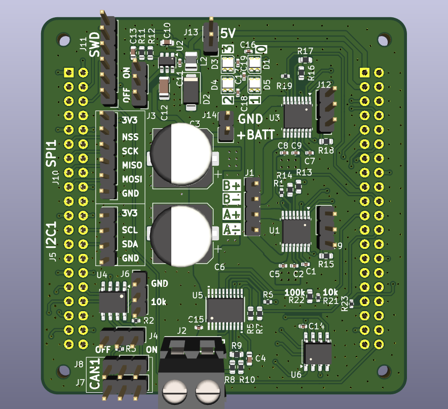
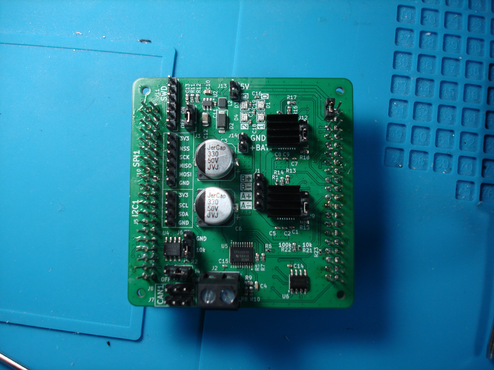
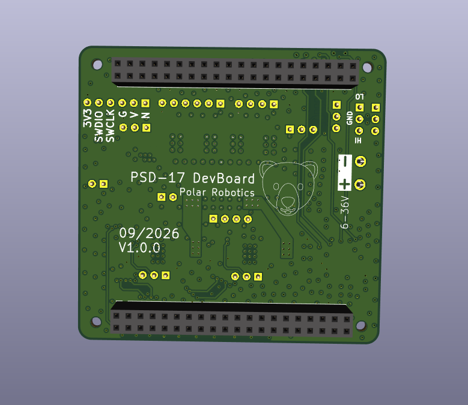
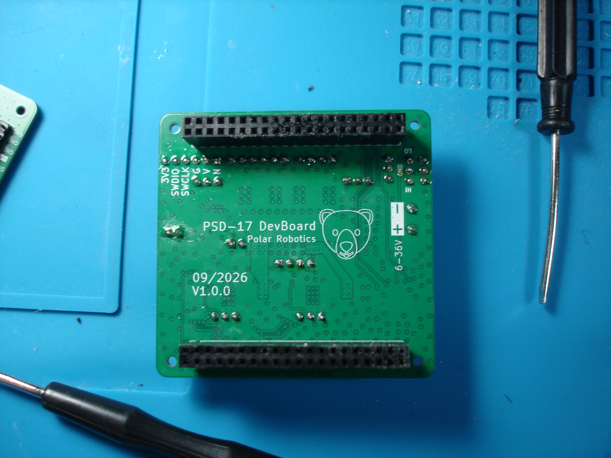
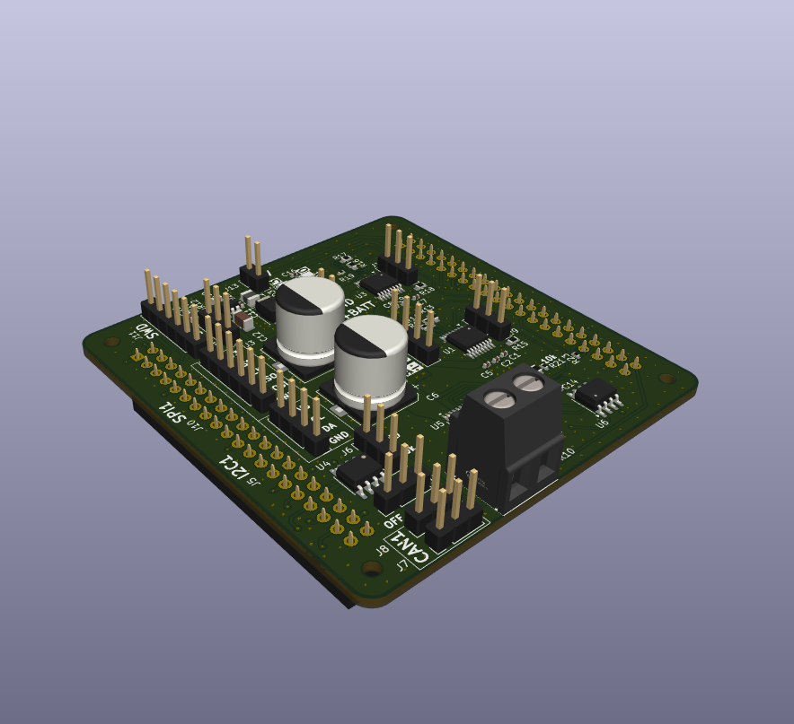
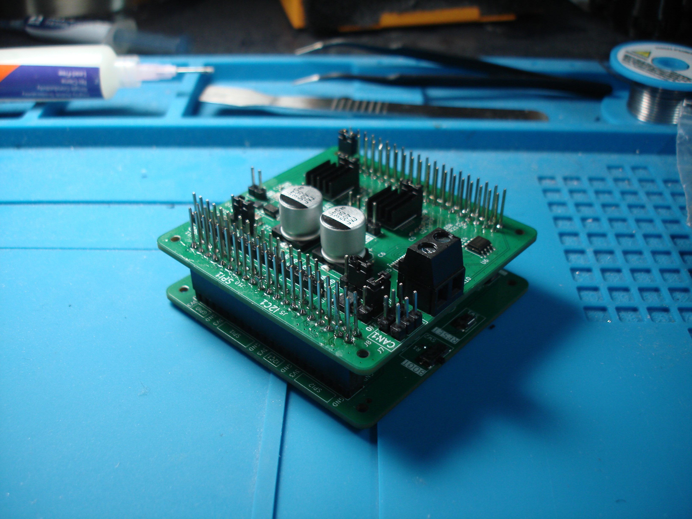
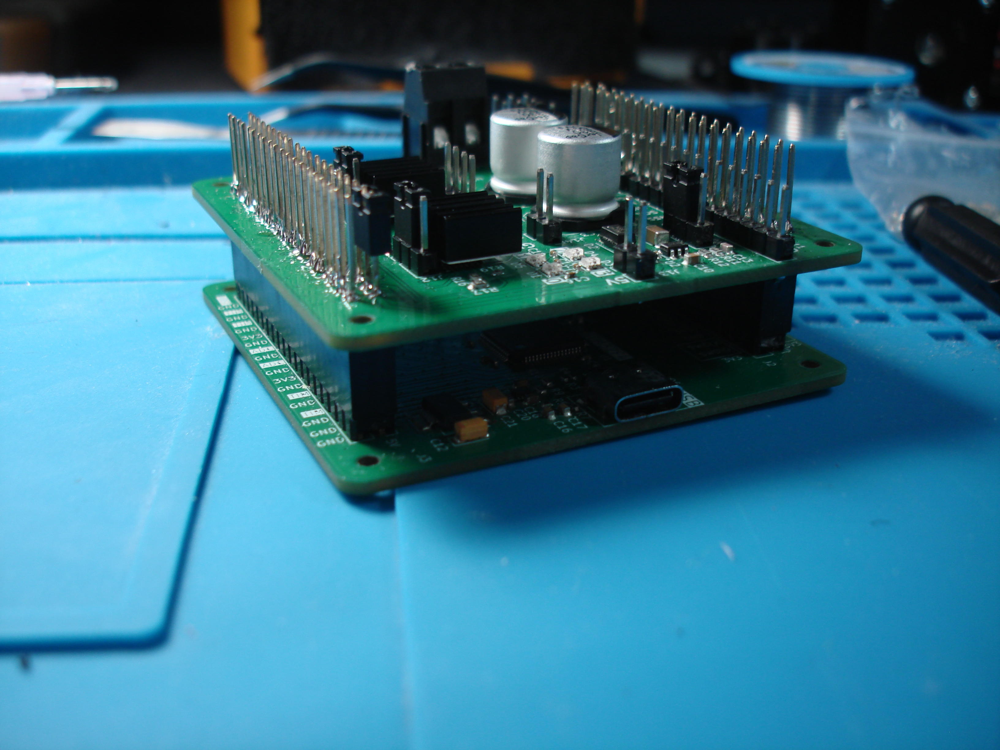
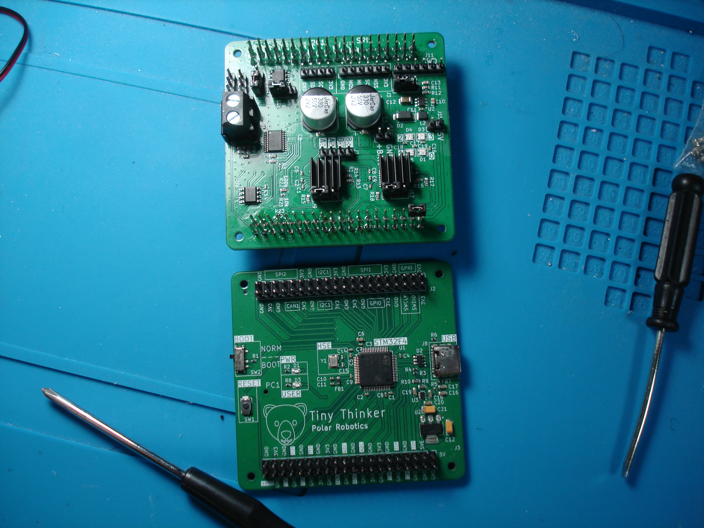
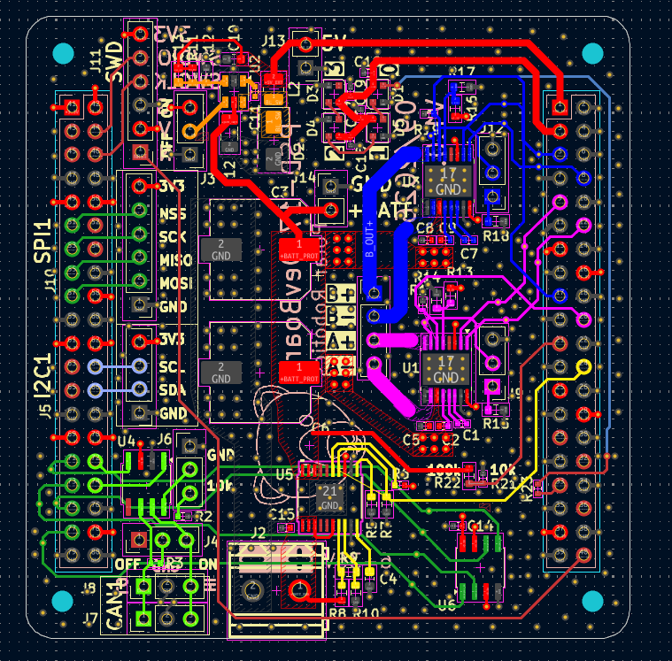

# PSD-17DB
This is a breakout board mainly for the DRV8874, but includes other ICs that help with integrating FOC. About the name, it is short for "Polar Stepper Drive 17 - Dev Board". Polar because I like polar bears and 17 for usage with NEMA 17 stepper motors. 

I designed this to go ontop of my [Tiny Thinker STM32](https://github.com/awesomeyooner/Tiny-Thinker) board.

## Features

- Dual [DRV8874 DC Motor Drivers](https://www.ti.com/lit/ds/symlink/drv8874.pdf?ts=1771238599696&ref_url=https%253A%252F%252Fwww.ti.com%252Fproduct%252FDRV8874%253Futm_source%253Dgoogle%2526utm_medium%253Dcpc%2526utm_campaign%253Dasc-null-null-GPN_EN-cpc-pf-google-eu_en_cons%2526utm_content%253DDRV8874%2526ds_k%253DDRV8874%2526DCM%253Dyes%2526gclsrc%253Daw.ds%2526gad_source%253D1%2526gad_campaignid%253D22742262375%2526gbraid%253D0AAAAAC068F3q_rkOjBg-sGu1AFhcQcEB0%2526gclid%253DCjwKCAiAncvMBhBEEiwA9GU_frk0FdI0UqCFervrmzUeQgJwxR8Tbq2dDl-pLHAbzLqAp0WEUr1cQxoCd_4QAvD_BwE) to control each phase
- [TPS16630](https://www.ti.com/lit/ds/symlink/tps1663.pdf?ts=1789169253557&ref_url=https%253A%252F%252Fwww.mouser.com%252F) mainly for inrush current protection (due to high capacitance)
- [BL9342 5V Step down converter](https://www.alldatasheet.com/datasheet-pdf/view/1033628/BELLING/BL9342.html) for powering the MCU using a battery
- Integrated [CAN Transciever](https://www.ti.com/lit/ds/symlink/sn65hvd230.pdf) for `CAN2.0B`
- [32Kbit SPI EEPROM](https://www.st.com/resource/en/datasheet/m95320-w.pdf) for storing parameters like `CAN ID`, `Eccentricity Offsets`, `Electrical Offset`, etc
- 4 [WS2812B RGB LEDs](https://mm.digikey.com/Volume0/opasdata/d220001/medias/docus/8903/XL-0807RGBC-WS2812B.pdf) for status lights
- R-Divider for input voltage sensing using ADC

## Pictures

